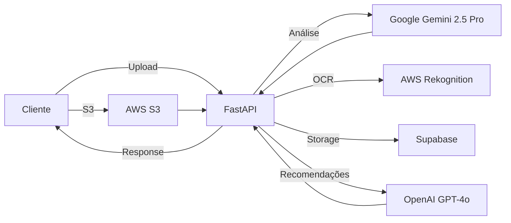

#  Klike AI Services

<div align="center">

**API de Análise Inteligente de Vídeos para Otimização de Criativos Publicitários**

[](https://fastapi.tiangolo.com/)
[](https://www.python.org/)
[](LICENSE)
[](https://klike-ai.github.io/klike-ai-services)

[ Documentação](https://klike-ai.github.io/klike-ai-services) • [Quick Start](#-quick-start) • [Features](#-features)

</div>

---

## O que é o Klike AI Services?

Analise vídeos publicitários com inteligência artificial e receba insights acionáveis para otimizar performance em plataformas como **Meta**, **TikTok** e **LinkedIn**.

###  Features Principais

-  **Análise de 9 Métricas Criativas** - Hook, storytelling, emoção, música, produto, valor, CTA, comunidade e qualidade
-  **Recomendações Personalizadas** - Ações específicas para melhorar cada métrica
-  **Detecção Automática de Issues** - Safe zone, legendas, aspect ratio, guidelines
-  **Multi-plataforma** - Otimização para Meta, TikTok, LinkedIn
-  **Segmentação de Audiência** - Gen Z, Millennials, Gen X, Boomers
-  **Integração S3** - Upload direto do frontend para AWS S3
-  **Background Tasks** - Processamento assíncrono sem bloqueio
-  **Processamento Paralelo** - Upload, legendas e frames em paralelo

---

##  Documentação Completa

**[https://klike-ai.github.io/klike-ai-services](https://klike-ai.github.io/klike-ai-services)**

A documentação inclui:

   [Guia de Instalação](https://klike-ai.github.io/klike-ai-services/getting-started/installation/)
-  [Configuração](https://klike-ai.github.io/klike-ai-services/getting-started/configuration/)
-  [Quick Start](https://klike-ai.github.io/klike-ai-services/getting-started/quickstart/)
-  [API Reference](https://klike-ai.github.io/klike-ai-services/api/overview/)
-  [Arquitetura](https://klike-ai.github.io/klike-ai-services/architecture/overview/)

---

##  Quick Start

### 1. Instalação

```bash
# Clone o repositório
git clone https://github.com/klike-ai/klike-ai-services.git
cd klike-ai-services

# Crie ambiente virtual
python -m venv env
source env/bin/activate  # Windows: env\Scripts\activate

# Instale dependências
pip install -r requirements.txt
```

### 2. Configuração

Crie `.env` na raiz:

```bash
GOOGLE_API_KEY=sua_chave_google_gemini
OPENAI_API_KEY=sua_chave_openai
AWS_ACCESS_KEY_ID=sua_access_key
AWS_SECRET_ACCESS_KEY=sua_secret_key
S3_BUCKET_NAME=seu-bucket
SUPABASE_URL=sua_url_supabase
SUPABASE_KEY=sua_chave_supabase
```

### 3. Execute

```bash
uvicorn app.app:app --reload --host 0.0.0.0 --port 8000
```

**Acesse:** [http://localhost:8000/docs](http://localhost:8000/docs)

---

## Exemplo de Uso

### Upload e Análise de Vídeo

```python
import requests

# Upload de vídeo
url = "http://localhost:8000/video/upload-video-async"
files = {"file": open("video.mp4", "rb")}
data = {
    "audience": ["millennials"],
    "platform_type": ["meta"],
    "language": "pt"
}

response = requests.post(url, files=files, data=data)
task_id = response.json()["task_id"]

# Consultar resultado
status_url = f"http://localhost:8000/video/task/{task_id}"
result = requests.get(status_url).json()

print(f"Score: {result['result']['score']}")
print(f"Stage: {result['result']['stage']}")
```

### Resposta da API

```json
{
  "score": 75,
  "stage": "B",
  "analysis": {
    "creative_metrics": [...],
    "detected_issues": {
      "safezone": true,
      "small_subtitles": false
    }
  },
  "actions": {
    "actions_creatives": {
      "action_hook_score": ["Use pergunta direta nos 3 primeiros segundos"]
    },
    "actions_issues": {
      "action_safezone": ["Mova elementos para zona segura 1080x1420px"]
    }
  }
}
```

---

##  Arquitetura



### Stack Tecnológica

| Categoria | Tecnologia |
|-----------|------------|
| **Framework** | FastAPI 0.104+ |
| **Análise IA** | Google Gemini 2.5 Pro |
| **Recomendações** | OpenAI GPT-4o-mini + LangChain |
| **Cloud Storage** | AWS S3, Supabase |
| **Processamento** | AWS Rekognition, OpenCV, FFmpeg |
| **Background Jobs** | Threading, Asyncio |

---

##  Estrutura do Projeto

```
klike-ai-services/
├── app/
│   ├── routers/              # Endpoints da API
│   │   ├── video_router.py   # Análise de vídeos
│   │   └── calculator_router.py
│   ├── services/             # Lógica de negócio
│   ├── utils/                # Utilitários
│   ├── schemas/              # Modelos Pydantic
│   └── prompts/              # Prompts para IA
├── docs/                     # Documentação MkDocs
├── scripts/                  # Scripts auxiliares
├── requirements.txt          # Dependências Python
└── mkdocs.yml               # Configuração da documentação
```

---

##  Casos de Uso

| Usuário | Caso de Uso |
|---------|-------------|
| **Agências** | Analisar dezenas de criativos antes de veiculação |
| **Marketing** | Entender por que alguns vídeos performam melhor |
| **Criadores** | Feedback instantâneo antes de publicar |
| **E-commerce** | Otimizar vídeos de produto para cada plataforma |

---

##  Links Úteis

-  **Documentação**: [https://klike-ai.github.io/klike-ai-service-docs](https://klike-ai.github.io/klike-ai-service-docs)
