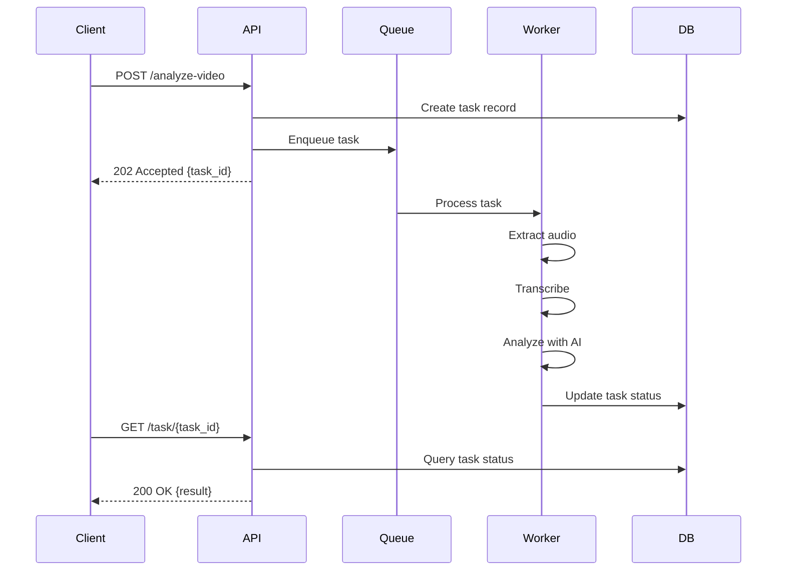
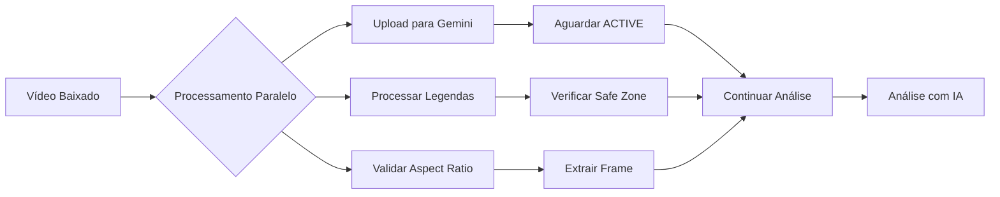

# Background Tasks

As análises de vídeo são processadas de forma assíncrona usando um sistema de tasks em background, permitindo que a API responda imediatamente sem bloquear o cliente.

##  Visão Geral

Quando você envia um vídeo para análise, a API:

1. **Valida** o vídeo e cria um registro no banco
2. **Retorna imediatamente** com um `task_id`
3. **Processa em background** a análise completa
4. **Notifica** quando completo (via webhook ou polling)



##  Estados das Tasks

| Estado | Descrição | Ação Recomendada |
|--------|-----------|------------------|
| `queued` | Task aguardando processamento | Continue polling |
| `processing` | Análise em andamento | Continue polling |
| `completed` | Análise finalizada com sucesso | Recupere os resultados |
| `failed` | Erro durante processamento | Verifique o erro e reenvie |
| `cancelled` | Task cancelada pelo usuário | - |

##  Consultar Status

### Endpoint

```
GET video/tasks/{task_id}
```

### Exemplo de Requisição

=== "Python"

    ```python
    import requests
    import time

    task_id = "550e8400-e29b-41d4-a716-446655440000"
    
    while True:
        response = requests.get(f"http://localhost:8000/video/tasks/{task_id}")
        task = response.json()
        
        if task["status"] == "completed":
            print("Análise completa!")
            print(f"Score: {task['result']['score']}")
            break
        elif task["status"] == "failed":
            print(f"Erro: {task['error']}")
            break
        else:
            print(f"Status: {task['status']} - Progress: {task['progress']}%")
            time.sleep(2)  # Aguarda 2 segundos antes de verificar novamente
    ```

=== "cURL"

    ```bash
    curl http://localhost:8000/video/tasks/550e8400-e29b-41d4-a716-446655440000
    ```

=== "JavaScript"

    ```javascript
    async function pollTask(taskId) {
      while (true) {
        const response = await fetch(`http://localhost:8000/video/tasks/${taskId}`);
        const task = await response.json();
        
        if (task.status === 'completed') {
          console.log('Análise completa!', task.result);
          return task.result;
        } else if (task.status === 'failed') {
          throw new Error(task.error);
        } else {
          console.log(`Status: ${task.status} - Progress: ${task.progress}%`);
          await new Promise(resolve => setTimeout(resolve, 2000));
        }
      }
    }
    
    pollTask('550e8400-e29b-41d4-a716-446655440000')
      .then(result => console.log('Score:', result.score))
      .catch(error => console.error('Erro:', error));
    ```

### Resposta

```json
{
  "task_id": "550e8400-e29b-41d4-a716-446655440000",
  "status": "processing",
  "progress": 65,
  "created_at": "2024-01-15T10:30:00Z",
  "updated_at": "2024-01-15T10:32:45Z",
  "estimated_completion": "2024-01-15T10:35:00Z",
  "metadata": {
    "video_duration": 45.2,
    "video_size_mb": 12.5,
    "current_step": "ai_analysis"
  }
}
```

## Tempos de Processamento

O tempo de processamento varia conforme o tamanho e complexidade do vídeo:

| Duração do Vídeo | Tempo Estimado |
|------------------|----------------|
| 0-30s | 30-60s |
| 30s-1min | 1-2min |
| 1-3min | 2-5min |
| 3-5min | 5-8min |
| 5min+ | 8-15min |

### Processamento Paralelo

O sistema realiza múltiplas operações em paralelo para otimizar o tempo:



**Operações Paralelas:**

1. Upload do vídeo para Google Gemini
2. Processamento de legendas e verificação de safe zone
3. Validação de aspect ratio e captura de frame (se necessário)

**Benefícios:**

- Redução de até 40% no tempo total de processamento
- Melhor utilização de recursos do servidor
- Resposta mais rápida para o usuário

**Exemplo de Implementação:**

```python
import concurrent.futures

def process_video_background(task_id, video_path):
    with concurrent.futures.ThreadPoolExecutor(max_workers=3) as executor:
        # Submeter tasks em paralelo
        future_upload = executor.submit(upload_to_gemini, video_path)
        future_subtitles = executor.submit(process_subtitles, video_path)
        future_aspect_ratio = executor.submit(check_aspect_ratio, video_path)
        
        # Aguardar resultados
        uploaded = future_upload.result()
        subtitles = future_subtitles.result()
        aspect_ratio = future_aspect_ratio.result()
        
        # Continuar com análise
        return analyze_with_ai(uploaded, subtitles, aspect_ratio)
```

!!! tip "Otimização"
    - Vídeos em resolução 1080p ou superior podem levar mais tempo
    - Compressão prévia pode reduzir o tempo de processamento
    - Use upload direto para S3 para reduzir latência
    - Processamento paralelo reduz tempo em 30-40%

## Webhooks (Futuro)

Em breve, você poderá configurar webhooks para receber notificações automáticas:

```json
{
  "webhook_url": "https://seu-servidor.com/webhook",
  "events": ["task.completed", "task.failed"]
}
```

Quando a task for concluída, você receberá:

```json
{
  "event": "task.completed",
  "task_id": "550e8400-e29b-41d4-a716-446655440000",
  "timestamp": "2024-01-15T10:35:00Z",
  "result": {
    "score": 8.7,
    "creative_score": {...},
    "detected_issues": [...]
  }
}
```

##  Cancelar Task

### Endpoint

```
DELETE /video/tasks/{task_id}
```

### Exemplo

=== "Python"

    ```python
    import requests

    task_id = "550e8400-e29b-41d4-a716-446655440000"
    response = requests.delete(f"http://localhost:8000/video/tasks/{task_id}")
    
    if response.status_code == 200:
        print("Task cancelada com sucesso!")
    ```

=== "cURL"

    ```bash
    curl -X DELETE http://localhost:8000/video/tasks/550e8400-e29b-41d4-a716-446655440000
    ```

!!! warning "Atenção"
    Tasks em estado `processing` podem levar alguns segundos para serem canceladas completamente.

## Listar Tasks

### Endpoint

```
GET /video/tasks?status=completed&limit=10
```

### Parâmetros de Query

| Parâmetro | Tipo | Descrição | Default |
|-----------|------|-----------|---------|
| `status` | string | Filtrar por status | Todos |
| `limit` | integer | Número de resultados | 20 |
| `offset` | integer | Paginação | 0 |
| `sort` | string | Ordenação (`created_at`, `-created_at`) | `-created_at` |

### Exemplo

```python
import requests

response = requests.get(
    "http://localhost:8000/video/tasks",
    params={
        "status": "completed",
        "limit": 10,
        "sort": "-created_at"
    }
)

tasks = response.json()
for task in tasks["items"]:
    print(f"{task['task_id']}: Score {task['result']['score']}")
```

### Resposta

```json
{
  "total": 150,
  "limit": 10,
  "offset": 0,
  "items": [
    {
      "task_id": "550e8400-e29b-41d4-a716-446655440000",
      "status": "completed",
      "created_at": "2024-01-15T10:30:00Z",
      "result": {
        "score": 8.7,
        "video_url": "https://..."
      }
    }
  ]
}
```

## Melhores Práticas

### Polling Inteligente

Use backoff exponencial para reduzir carga:

```python
import time

def smart_poll(task_id, initial_delay=2, max_delay=30):
    delay = initial_delay
    
    while True:
        response = requests.get(f"http://localhost:8000/video/tasks/{task_id}")
        task = response.json()
        
        if task["status"] in ["completed", "failed"]:
            return task
        
        time.sleep(delay)
        delay = min(delay * 1.5, max_delay)  # Aumenta o delay gradualmente
```

### Tratamento de Erros

```python
def process_task(task_id, max_retries=3):
    for attempt in range(max_retries):
        try:
            result = poll_task(task_id)
            return result
        except requests.exceptions.Timeout:
            if attempt == max_retries - 1:
                raise
            time.sleep(2 ** attempt)  # Exponential backoff
        except requests.exceptions.RequestException as e:
            print(f"Erro na tentativa {attempt + 1}: {e}")
            if attempt == max_retries - 1:
                raise
```

##  Troubleshooting

### Task travada em "processing"

Se uma task ficar mais de 15 minutos em processamento:

1. Verifique se o worker está ativo
2. Consulte os logs do servidor
3. Cancele e reenvie o vídeo

### Erros comuns

| Erro | Causa | Solução |
|------|-------|---------|
| `TASK_NOT_FOUND` | Task ID inválido | Verifique o ID retornado |
| `TASK_EXPIRED` | Task muito antiga (>7 dias) | Reenvie o vídeo |
| `PROCESSING_TIMEOUT` | Vídeo muito longo | Divida o vídeo ou reduza resolução |

##  Próximos Passos
- Explore a [Integração S3](s3-integration.md) para uploads diretos
