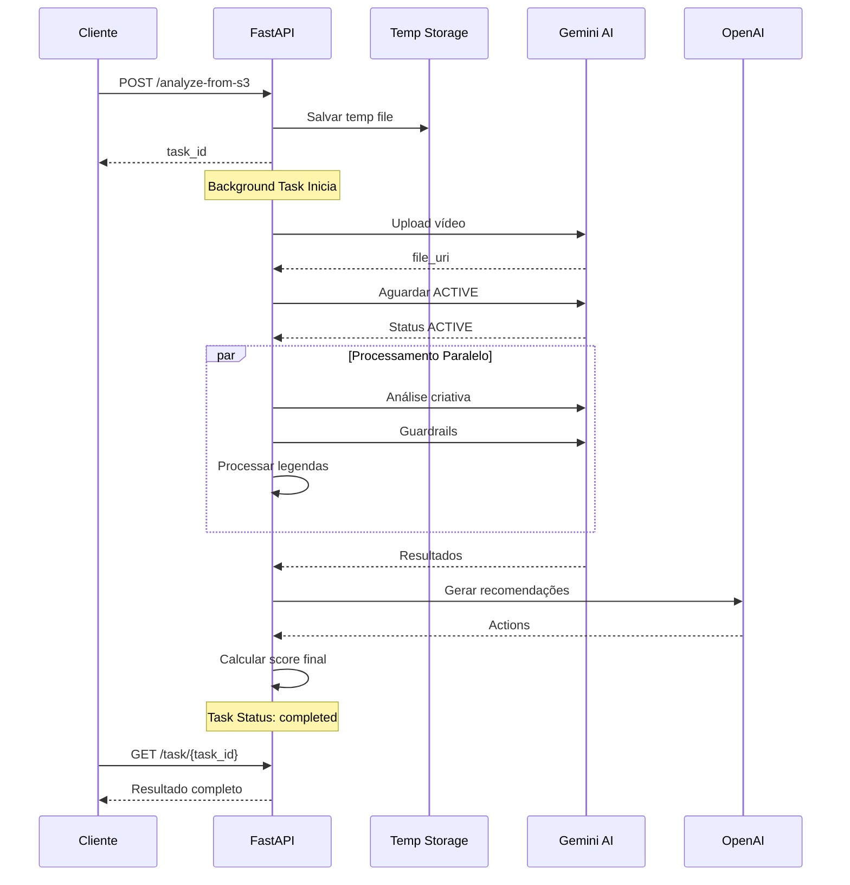

Análise de Vídeos

Documentação detalhada dos endpoints de análise de vídeos.

---

## `POST /video/upload-video-async`

Upload e análise assíncrona de vídeo via API (multipart/form-data).

### Características

- Upload direto de arquivo via API
- Processamento em background task
- Limite de 100MB por arquivo
- Retorna task_id para polling
- Suporta múltiplas audiências e plataformas

### Request

**Content-Type:** `multipart/form-data`

**Parameters:**

| Campo | Tipo | Obrigatório | Descrição |
|-------|------|-------------|-----------|
| `file` | File | Sim | Arquivo de vídeo (MP4, AVI, MOV, etc.) |
| `audience` | Array | Não | Lista de audiências separadas por vírgula |
| `platform_type` | Array | Não | Lista de plataformas separadas por vírgula |
| `language` | String | Não | `pt` ou `en` (padrão: `en`) |

**Formatos aceitos:** MP4, AVI, MOV, MKV, WMV, FLV, WEBM

**Exemplo cURL:**

```bash
curl -X POST "http://localhost:8000/video/upload-video-async" \
  -F "file=@video.mp4" \
  -F "audience=millennials,genz" \
  -F "platform_type=meta,tiktok" \
  -F "language=pt"
```

**Exemplo Python:**

```python
import requests

with open('video.mp4', 'rb') as f:
    response = requests.post(
        'http://localhost:8000/video/upload-video-async',
        files={'file': f},
        data={
            'audience': 'millennials,genz',
            'platform_type': 'meta,tiktok',
            'language': 'pt'
        }
    )

task_data = response.json()
print(f"Task ID: {task_data['task_id']}")
```

**Exemplo JavaScript:**

```javascript
const formData = new FormData();
formData.append('file', videoFile);
formData.append('audience', 'millennials,genz');
formData.append('platform_type', 'meta,tiktok');
formData.append('language', 'pt');

const response = await fetch('http://localhost:8000/video/upload-video-async', {
  method: 'POST',
  body: formData
});

const { task_id, check_status_url } = await response.json();
```

### Response

**Status: 200 OK**

```json
{
  "task_id": "8a72e48b-ca60-44d2-b126-a8dbb0500771",
  "status": "accepted",
  "message": "Análise iniciada. Use o task_id para consultar o progresso.",
  "check_status_url": "/video/task/8a72e48b-ca60-44d2-b126-a8dbb0500771"
}
```

**Campos:**

- `task_id`: ID único para consultar o progresso
- `status`: Sempre "accepted" no retorno inicial
- `message`: Mensagem descritiva
- `check_status_url`: URL para consultar status

### Consultar Progresso

Use o endpoint `GET /video/task/{task_id}` para verificar o status:

```bash
curl "http://localhost:8000/video/task/8a72e48b-ca60-44d2-b126-a8dbb0500771"
```

Ver detalhes em [Background Tasks](background-tasks.md).

### Erros Comuns

**400 Bad Request - Formato não suportado**

```json
{
  "detail": "Formato de vídeo não suportado"
}
```

**Solução:** Use MP4, MOV, AVI, MKV, WMV, FLV ou WEBM.

**413 Payload Too Large**

```json
{
  "detail": "Arquivo muito grande. Máximo: 100MB"
}
```

**Solução:** Comprima o vídeo ou use [integração S3](s3-integration.md).

**500 Internal Server Error**

```json
{
  "detail": "Erro ao iniciar processamento: [detalhes]"
}
```

**Solução:** Verifique os logs do servidor e tente novamente.

---

## `POST /video/analyze-from-s3`

Análise de vídeo já armazenado no S3 (sem upload de bytes).

### Request


**Parameters:**

| Campo | Tipo | Obrigatório | Descrição |
|-------|------|-------------|-----------|
| `file` | File |  Sim | Arquivo MP4 (max 100MB) |
| `audience` | Array |  Não | Lista de audiências |
| `platform_type` | Array |  Não | Lista de plataformas |
| `language` | String |  Não | `pt` ou `en` (padrão: `en`) |

**Exemplo:**

```bash
curl -X POST "http://localhost:8000/video/analyze-from-s3" \
  -F "file=@video.mp4" \
  -F "audience=millennials" \
  -F "audience=genz" \
  -F "platform_type=meta" \
  -F "platform_type=tiktok" \
  -F "language=pt"
```

### Response

**Status: 200 OK**

```json
{
  "task_id": "a1b2c3d4-e5f6-7890-abcd-ef1234567890",
  "status": "accepted",
  "message": "Vídeo enviado para análise em background...",
  "check_status_url": "/video/task/a1b2c3d4-e5f6-7890-abcd-ef1234567890",
  "file_name": "video.mp4"
}
```

### Fluxo de Processamento



### Progress Tracking

O campo `progress` é atualizado durante o processamento:

| Progress | Etapa |
|----------|-------|
| 5% | Upload para Gemini iniciado |
| 20% | Arquivo enviado |
| 30% | Aguardando processamento |
| 40% | Análise de guardrails |
| 55% | Processamento de legendas |
| 65% | Montagem de prompts |
| 85% | Análise com modelo |
| 95% | Geração de actions |
| 100% | Concluído |

---

## `GET /video/task/{task_id}`

Consulta o status e resultado de uma tarefa de análise.

### Request

**Path Parameters:**

| Campo | Tipo | Descrição |
|-------|------|-----------|
| `task_id` | String (UUID) | ID da tarefa |

**Exemplo:**

```bash
curl "http://localhost:8000/video/task/a1b2c3d4-e5f6-7890"
```

### Response - Em Processamento

**Status: 200 OK**

```json
{
  "task_id": "a1b2c3d4-e5f6-7890",
  "status": "processing",
  "progress": 65,
  "created_at": "2025-12-08T16:30:00",
  "updated_at": "2025-12-08T16:31:30",
  "file_name": "video.mp4"
}
```

### Response - Concluído

**Status: 200 OK**

```json
{
  "task_id": "a1b2c3d4-e5f6-7890",
  "status": "completed",
  "progress": 100,
  "created_at": "2025-12-08T16:30:00",
  "updated_at": "2025-12-08T16:32:45",
  "file_name": "video.mp4",
  "result": {
    "message": "Video uploaded and analyzed successfully",
    "file_name": "files/xyz123",
    "analysis": {
      "creative_metrics": [...],
      "audience_scores": {...},
      "platform_recommendations": [...],
      "detected_issues": {...}
    },
    "score": 75,
    "stage": "B",
    "audiences_recommendations": [...],
    "warning": {...},
    "actions": {
      "actions_creatives": {...},
      "actions_issues": {...},
      "actions_platforms": {...},
      "actions_audiences": {...}
    }
  }
}
```

### Response - Falhou

**Status: 200 OK**

```json
{
  "task_id": "a1b2c3d4-e5f6-7890",
  "status": "failed",
  "progress": 45,
  "created_at": "2025-12-08T16:30:00",
  "updated_at": "2025-12-08T16:31:15",
  "file_name": "video.mp4",
  "error": "Erro durante o processamento: Timeout ao aguardar arquivo ficar ACTIVE"
}
```

### Response - Não Encontrado

**Status: 404 Not Found**

```json
{
  "detail": "Tarefa não encontrada"
}
```

---

## `GET /video/tasks`

Lista todas as tarefas do usuário (últimas 24h).

### Request

```bash
curl "http://localhost:8000/video/tasks"
```

### Response

**Status: 200 OK**

```json
{
  "tasks": [
    {
      "task_id": "a1b2c3d4-e5f6-7890",
      "status": "completed",
      "progress": 100,
      "created_at": "2025-12-08T16:30:00",
      "updated_at": "2025-12-08T16:32:45",
      "file_name": "video1.mp4"
    },
    {
      "task_id": "b2c3d4e5-f6g7-8901",
      "status": "processing",
      "progress": 65,
      "created_at": "2025-12-08T16:35:00",
      "updated_at": "2025-12-08T16:36:20",
      "file_name": "video2.mp4"
    }
  ],
  "total_tasks": 2,
  "removed_old_tasks": 3
}
```

**Nota:** Tarefas com mais de 24h são automaticamente removidas.

---

##  Estrutura do Resultado

### Creative Metrics

9 métricas que avaliam aspectos criativos:

```json
{
  "metric_name": "3 Second Hook Score",
  "score": 85,
  "stage": "A",
  "reasoning": {
    "what_went_well": [
      "Pergunta direta e instigante nos primeiros segundos",
      "Visual atraente que captura atenção imediata"
    ],
    "room_for_improvement": [
      "Poderia ter um elemento surpresa maior",
      "Visual inicial um pouco genérico"
    ]
  }
}
```

**Métricas disponíveis:**

1. 3 Second Hook Score
2. Storytelling with Contrast Score
3. Emotional Connection Score
4. Music, Voice-over & Subtitles Score
5. Product or Service Focus Score
6. Value Proposition Score
7. CTA Score
8. Community Score
9. Video Resolution & Quality Score

### Audience Scores

Pontuação para cada audiência:

```json
{
  "genz": "Geração Z",
  "score_genz": 55,
  "reasoning_genz": "A alta qualidade de produção pode parecer pouco autêntica...",
  
  "millennials": "Millennials",
  "score_millennials": 88,
  "reasoning_millennials": "A mensagem de propósito e legado ressoa fortemente...",
  
  "genx": "Geração X",
  "score_genx": 85,
  "reasoning_genx": "A proposta de valor clara e qualidade profissional...",
  
  "boomer": "Boomers",
  "score_boomer": 82,
  "reasoning_boomer": "A clareza da mensagem e reputação da marca..."
}
```

### Platform Recommendations

Recomendações específicas por plataforma:

```json
{
  "platform": "meta",
  "recommendations": [
    "Incorpore uma narração (voice-over) para complementar legendas",
    "Teste versão com produto nos primeiros 3 segundos",
    "Crie versão UGC com depoimentos reais",
    "Adicione urgência no CTA"
  ]
}
```

### Detected Issues

Issues técnicas com desconto no score:

```json
{
  "safezone": true,
  "details_safezone": {
    "issue": "Elementos fora da safe zone vertical (1080x1920)",
    "impact": "Elementos cruciais podem ser cortados pela UI",
    "recommendation": "Manter elementos na área central 1080x1420px",
    "discount_applied": 10,
    "frames_example_urls": [
      "https://supabase.co/storage/frames/frame_480.jpg",
      "https://supabase.co/storage/frames/frame_570.jpg"
    ]
  },
  "small_subtitles": false,
  "fake_content": false,
  "subtitle_position": false,
  "guideline_compliance": false,
  "hook_cta_char_limit": true,
  "details_hook_cta_char_limit": {
    "hook_violation": {
      "has_violation": true,
      "detected_length": 65,
      "platforms": ["TikTok"],
      "limit": 60,
      "impact": "Hook pode ser truncado na exibição",
      "recommendation": "Reduza o Hook para até 60 caracteres"
    },
    "cta_violation": {
      "has_violation": false
    },
    "discount_applied": 5
  },
  "non_native_vertical_aspect_ratio_violation": true,
  "details_non_native_vertical_aspect_ratio_violation": {
    "issue": "Vídeo horizontal em plataforma vertical (TikTok/Meta)",
    "detected_aspect_ratio": "16:9",
    "recommended_aspect_ratio": "9:16",
    "impact": "Visualização reduzida em devices mobile",
    "recommendation": "Grave ou edite em formato vertical 9:16",
    "discount_applied": 3,
    "frame_example_url": "https://supabase.co/storage/aspect-ratio/frame_example.jpg"
  }
}
```

### Actions

Ações específicas geradas por IA:

```json
{
  "actions_creatives": {
    "action_storytelling_with_contrast_score": [
      "Incluir cena visual clara do 'depois'",
      "Adicionar gráficos que ilustrem o contraste",
      "Usar depoimentos visuais de clientes"
    ],
    "action_cta_score": [
      "Adicionar narração que verbalize o CTA",
      "Incluir senso de urgência como 'tempo limitado'"
    ]
  },
  "actions_issues": {
    "action_safezone": [
      "Mover elementos para zona segura central",
      "Evitar colocar CTAs próximo às bordas"
    ]
  },
  "actions_platforms": {
    "action_meta": [
      "Iniciar com logo da marca nos 3 primeiros segundos",
      "Adicionar trilha sonora envolvente",
      "Usar estilo UGC autêntico"
    ]
  },
  "actions_audiences": {
    "action_millennials": [
      "Desenvolver vídeo com problema-solução-resultado",
      "Incluir depoimentos de clientes reais",
      "Mostrar jornada do cliente"
    ]
  }
}
```

---

##  Erros Comuns

### 413 Payload Too Large

```json
{
  "detail": "Vídeo muito grande. Máximo: 100MB"
}
```

**Solução:** Comprima o vídeo ou use [integração S3](s3-integration.md).

### 422 Unprocessable Entity

```json
{
  "detail": [
    {
      "loc": ["body", "audience"],
      "msg": "field required",
      "type": "value_error.missing"
    }
  ]
}
```

**Solução:** Verifique os campos obrigatórios.

### 500 Internal Server Error

```json
{
  "detail": "Erro interno do servidor"
}
```

**Solução:** Verifique logs do servidor e credenciais no `.env`.

---

##  Boas Práticas

### Polling Inteligente

```python
import time

def wait_for_completion(task_id, max_wait=600):
    """
    Aguarda conclusão com backoff exponencial
    """
    intervals = [2, 2, 3, 5, 5, 10, 10, 15, 20, 30]
    elapsed = 0
    
    for interval in intervals:
        response = requests.get(f'/video/task/{task_id}')
        data = response.json()
        
        if data['status'] in ['completed', 'failed']:
            return data
        
        time.sleep(interval)
        elapsed += interval
        
        if elapsed >= max_wait:
            raise TimeoutError("Análise excedeu tempo máximo")
    
    return data
```

### Timeout Handling

```javascript
const analyzeWithTimeout = async (videoFile, timeout = 600000) => {
  const controller = new AbortController();
  const timeoutId = setTimeout(() => controller.abort(), timeout);
  
  try {
    const result = await analyzeVideo(videoFile, {
      signal: controller.signal
    });
    clearTimeout(timeoutId);
    return result;
  } catch (error) {
    if (error.name === 'AbortError') {
      throw new Error('Análise excedeu tempo limite');
    }
    throw error;
  }
};
```

---

**Veja também:**

- [Integração S3](s3-integration.md) para uploads maiores
- [Background Tasks](background-tasks.md) para detalhes técnicos
- [Calculator API](calculator.md) para estimativas de budget