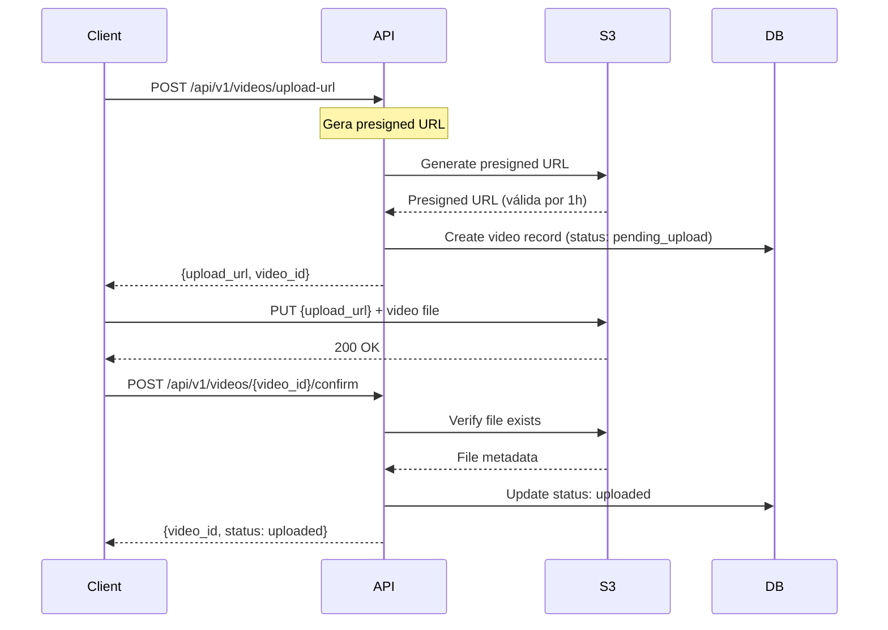
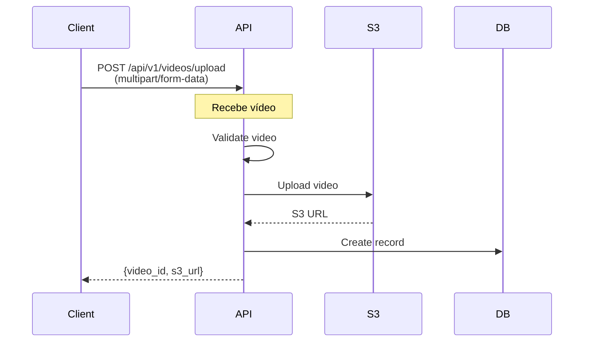
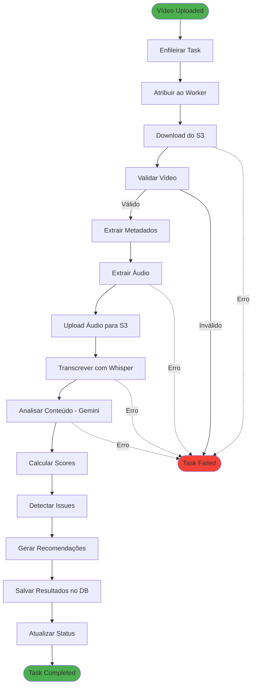
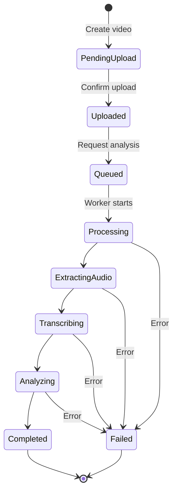

# Fluxo de Dados

Documentação detalhada sobre como os dados fluem através do sistema Klike AI Services em diferentes cenários.

## 🎯 Visão Geral

O sistema processa dados em múltiplos estágios:

1. **Ingestão**: Recepção de vídeos e metadados
2. **Armazenamento**: Persistência em S3 e banco de dados
3. **Processamento**: Extração, transcrição e análise
4. **Entrega**: Retorno de resultados ao cliente

## 📥 Fluxo de Upload

### Upload Direto para S3 (Recomendado)



**Vantagens:**

- ✅ Sem limite de tamanho de arquivo na API
- ✅ Upload mais rápido (direto ao S3)
- ✅ Menor carga no servidor API
- ✅ Progresso de upload no cliente

### Upload via API (Alternativo)



**Limitações:**

- ⚠️ Limite de 100MB por requisição
- ⚠️ Timeout após 5 minutos
- ⚠️ Maior carga no servidor

## 🔄 Fluxo de Processamento

### Pipeline Completo



### Etapas Detalhadas

#### 1. Download e Validação

**Entrada:**

- `video_id`: UUID do vídeo
- `s3_url`: URL no S3

**Processamento:**

```python
# Download do S3
video_data = s3_client.download(s3_url)

# Validações
validations = {
    "format": check_format(video_data),      # MP4, MOV, AVI
    "duration": check_duration(video_data),  # 5s - 300s
    "size": check_size(video_data),          # < 500MB
    "codec": check_codec(video_data),        # H.264, H.265
    "resolution": check_resolution(video_data) # >= 720p
}
```

**Saída:**

```json
{
  "valid": true,
  "metadata": {
    "format": "mp4",
    "duration": 30.5,
    "size_mb": 45.2,
    "codec": "h264",
    "resolution": "1920x1080",
    "fps": 30,
    "bitrate": 12000000
  }
}
```

#### 2. Extração de Áudio

**Entrada:**

- Arquivo de vídeo

**Processamento:**

```python
# FFmpeg command
ffmpeg -i input.mp4 \
  -vn \                      # Sem vídeo
  -acodec libmp3lame \       # Codec MP3
  -ab 192k \                 # Bitrate 192kbps
  -ar 44100 \                # Sample rate
  -y \                       # Sobrescrever
  output.mp3
```

**Saída:**

- Arquivo de áudio MP3
- Duração idêntica ao vídeo
- Tamanho ~3-5% do vídeo original

#### 3. Transcrição

**Entrada:**

- Arquivo de áudio MP3

**Processamento:**

```python
# OpenAI Whisper API
with open("audio.mp3", "rb") as audio_file:
    transcript = openai.Audio.transcribe(
        model="whisper-1",
        file=audio_file,
        language="pt",  # Auto-detectado se omitido
        response_format="verbose_json"
    )
```

**Saída:**

```json
{
  "text": "Descubra o novo produto revolucionário...",
  "language": "pt",
  "duration": 30.5,
  "segments": [
    {
      "id": 0,
      "start": 0.0,
      "end": 3.5,
      "text": "Descubra o novo produto revolucionário",
      "confidence": 0.95
    },
    {
      "id": 1,
      "start": 3.5,
      "end": 7.2,
      "text": "que vai transformar sua vida",
      "confidence": 0.93
    }
  ]
}
```

#### 4. Análise com IA

**Entrada:**

```python
analysis_input = {
    "transcript": "Descubra o novo produto...",
    "video_metadata": {
        "duration": 30.5,
        "resolution": "1920x1080",
        "has_audio": True
    },
    "context": {
        "audience": "jovens_adultos",
        "platform": "instagram",
        "objective": "awareness"
    }
}
```

**Processamento:**

```python
# Construir prompt
prompt = build_analysis_prompt(
    transcript=analysis_input["transcript"],
    metadata=analysis_input["video_metadata"],
    context=analysis_input["context"]
)

# Chamar Gemini
response = gemini.generate_content(
    prompt=prompt,
    model="gemini-pro",
    temperature=0.7
)

# Parse response
analysis = parse_gemini_response(response.text)
```

**Saída:**

```json
{
  "creative_score": {
    "hook_score": 8.5,
    "message_clarity": 9.0,
    "visual_appeal": 8.0,
    "audio_quality": 7.5,
    "call_to_action": 8.0
  },
  "detected_issues": [
    {
      "type": "visual",
      "severity": "medium",
      "description": "Texto muito pequeno nos primeiros 3 segundos",
      "timestamp": 2.5,
      "suggestion": "Aumentar tamanho da fonte para 48pt ou maior"
    }
  ],
  "strengths": [
    "Hook forte nos primeiros 3 segundos",
    "Mensagem clara e direta",
    "CTA bem posicionado"
  ],
  "weaknesses": [
    "Ritmo pode ser mais dinâmico",
    "Falta urgência no CTA"
  ]
}
```

#### 5. Detecção de Issues e Desconto de Score

**Issues Técnicas Detectadas:**

O sistema realiza validações técnicas paralelas ao processamento:

**A) Validação de Safe Zone**

```python
# Processar legendas e verificar safe zone
subtitles_result = process_video_subtitles(video_path, is_vertical_format)

# Estrutura retornada
{
    "subtitles_text": "Transcrição completa...",
    "has_safezone_violation": True,
    "frames_example_urls": [
        "https://supabase.co/storage/safezone/frame_480.jpg",
        "https://supabase.co/storage/safezone/frame_570.jpg"
    ]
}
```

**B) Validação de Aspect Ratio**

```python
# Detectar violação de aspect ratio
is_vertical = video_metadata['height'] > video_metadata['width']
platforms = ['TikTok', 'Meta']

non_native_violation = False

# Vídeo horizontal em plataforma vertical
if not is_vertical and any(p.lower() in ['tiktok', 'meta'] for p in platforms):
    non_native_violation = True
    # Processar frame de exemplo
    aspect_ratio_frame_url = process_aspect_ratio_violation(video_path, video_name)

# Vídeo vertical apenas em LinkedIn
elif is_vertical and all(p.lower() == 'linkedin' for p in platforms):
    non_native_violation = True
```

**C) Validação de Hook/CTA**

```python
hook = response['hook']
cta = response['cta']

# Limites por plataforma
limits = {
    'tiktok': {'hook': 60, 'cta': 30},
    'meta': {'hook': 80, 'cta': 40},
    'linkedin': {'hook': 100, 'cta': 50},
    'youtube': {'hook': None, 'cta': 50}
}

hook_cta_violations = check_hook_cta_char_violations(hook, cta, platforms)
```

**D) Cálculo de Score com Descontos**

```python
# Score inicial calculado pelos creative metrics
initial_score = calculate_score(response_json)  # Ex: 8.5

# Aplicar descontos por issues
discount_result = descont_score(
    response_json,
    initial_score,
    subtitles_text_and_safezone,
    non_native_vertical_aspect_ratio_violation,
    aspect_ratio_frame_url,
    hook_cta_violations,
    language
)

# Resultado
{
    "initial_score": 8.5,
    "final_score": 6.0,
    "total_discount": 2.5,
    "detected_issues": {
        "safezone": True,
        "details_safezone": {...},
        "hook_cta_char_limit": True,
        "details_hook_cta_char_limit": {...}
    }
}
```

**Tabela de Descontos:**

| Issue | Desconto | Gatilho |
|-------|----------|---------|
| small_subtitles | -4 pontos | Legendas < 24px |
| fake_content | -10 pontos | Conteúdo enganoso detectado |
| subtitle_position | -8 pontos | Legendas mal posicionadas |
| guideline_compliance | -12 pontos | Viola diretrizes da plataforma |
| safezone | -10 pontos | Elementos fora da área segura |
| hook_cta_char_limit | -5 pontos | Hook/CTA excede limite |
| non_native_vertical_aspect_ratio_violation | -3 pontos | Aspect ratio inadequado |

#### 6. Geração de Recomendações

**Entrada:**

- Análise da IA
- Scores calculados (inicial e final)
- Issues detectadas com detalhes

**Processamento:**

```python
recommendations = []

# Baseado em scores baixos
if creative_score.hook_score < 7:
    recommendations.append({
        "type": "improvement",
        "priority": "high",
        "category": "hook",
        "title": "Melhorar gancho inicial",
        "description": "Considere usar uma pergunta provocativa ou estatística impactante nos primeiros 3 segundos",
        "examples": [
            "Você sabia que 80% das pessoas...",
            "E se eu te contar um segredo..."
        ]
    })

# Baseado em issues
for issue in detected_issues:
    if issue["severity"] == "high":
        recommendations.append(
            generate_fix_recommendation(issue)
        )

# Baseado em melhores práticas
platform_best_practices = get_best_practices(platform)
recommendations.extend(platform_best_practices)
```

**Saída:**

```json
{
  "recommendations": [
    {
      "type": "improvement",
      "priority": "high",
      "category": "hook",
      "title": "Fortalecer gancho inicial",
      "description": "Os primeiros 3 segundos são cruciais. Adicione um elemento de surpresa ou curiosidade.",
      "impact": "Pode aumentar retenção em até 30%",
      "effort": "medium",
      "examples": [
        "Use uma pergunta provocativa",
        "Mostre o resultado final primeiro",
        "Adicione um fato surpreendente"
      ]
    },
    {
      "type": "fix",
      "priority": "medium",
      "category": "visual",
      "title": "Ajustar tamanho do texto",
      "description": "Textos devem ter no mínimo 48pt para legibilidade em mobile",
      "impact": "Melhora legibilidade em 50%",
      "effort": "low",
      "technical_details": {
        "current_size": "32pt",
        "recommended_size": "48-72pt",
        "affected_timestamps": [2.5, 8.3, 15.7]
      }
    }
  ],
  "total_recommendations": 8,
  "estimated_improvement": "+25% performance"
}
```

## 📊 Fluxo de Dados no Banco

### Estrutura de Tabelas

```sql
-- Videos
videos
├── id (uuid, PK)
├── user_id (uuid, FK)
├── title (text)
├── s3_url (text)
├── status (enum: pending, uploaded, processing, completed, failed)
├── created_at (timestamp)
└── updated_at (timestamp)

-- Tasks
tasks
├── id (uuid, PK)
├── video_id (uuid, FK)
├── status (enum: queued, processing, completed, failed)
├── progress (integer 0-100)
├── error_message (text, nullable)
├── created_at (timestamp)
└── updated_at (timestamp)

-- Analysis Results
analysis_results
├── id (uuid, PK)
├── video_id (uuid, FK)
├── creative_score (jsonb)
├── detected_issues (jsonb)
├── recommendations (jsonb)
├── transcript (text)
├── metadata (jsonb)
└── created_at (timestamp)
```

### Ciclo de Vida dos Dados



## 🔄 Fluxo de Cache

### Estratégia de Cache

```python
# Cache em múltiplas camadas
cache_layers = {
    "L1_Memory": {
        "location": "Application memory",
        "ttl": "5 minutes",
        "data": ["frequent queries", "user sessions"]
    },
    "L2_Redis": {
        "location": "Redis cluster",
        "ttl": "1 hour",
        "data": ["analysis results", "transcripts"]
    },
    "L3_S3": {
        "location": "S3 bucket",
        "ttl": "30 days",
        "data": ["processed videos", "audio files"]
    }
}
```

### Invalidação de Cache

```python
# Quando invalidar cache
invalidate_cache_on = [
    "video_reanalyzed",
    "user_deleted_video",
    "analysis_updated",
    "ttl_expired"
]
```

## 📈 Métricas de Fluxo

### Throughput

| Etapa | Tempo Médio | Throughput |
|-------|-------------|------------|
| Upload (S3 direct) | 5-30s | 100 videos/min |
| Download | 2-10s | 200 videos/min |
| Extração de áudio | 3-8s | 150 videos/min |
| Transcrição | 10-30s | 50 videos/min |
| Análise IA | 20-60s | 30 videos/min |
| **Total** | **40-130s** | **30 videos/min** |

### Gargalos Identificados

1. **Transcrição**: Limitado por API do Whisper
2. **Análise IA**: Limitado por rate limit do Gemini
3. **Download**: Dependente de latência de rede

##  Próximos Passos

- [Serviços](services.md) - Detalhes de implementação de cada serviço
- [Integrações](integrations.md) - Como integramos com serviços externos
- [Visão Geral da Arquitetura](overview.md) - Entenda a arquitetura completa do sistema