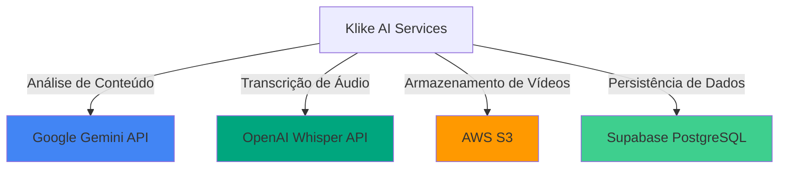

# Integrações Externas

Documentação das integrações com serviços externos utilizados pelo Klike AI Services.

## 🎯 Visão Geral

O sistema integra com diversos serviços externos para fornecer funcionalidades completas:



## 🤖 Google Gemini API

### Propósito

Análise inteligente de conteúdo criativo usando IA generativa de última geração.

### Configuração

```python
# .env
GOOGLE_GEMINI_API_KEY=your_api_key_here
```

### Cliente

```python
import google.generativeai as genai

genai.configure(api_key=os.getenv("GOOGLE_GEMINI_API_KEY"))

model = genai.GenerativeModel('gemini-pro')
```

### Uso no Sistema

#### Análise de Criatividade

```python
def analyze_creative_content(transcript: str, metadata: dict) -> dict:
    prompt = f"""
    Analise este vídeo publicitário:
    
    Transcrição: {transcript}
    Duração: {metadata['duration']}s
    
    Avalie:
    1. Hook (0-10)
    2. Clareza da mensagem (0-10)
    3. Apelo visual estimado (0-10)
    4. Call-to-action (0-10)
    
    Identifique issues e sugira melhorias.
    
    Responda em JSON.
    """
    
    response = model.generate_content(prompt)
    return parse_json_response(response.text)
```

#### Detecção de Issues

```python
def detect_issues(transcript: str, context: dict) -> list:
    prompt = f"""
    Identifique problemas neste vídeo para {context['platform']}:
    
    {transcript}
    
    Procure por:
    - Mensagem confusa
    - CTA ausente ou fraco
    - Ritmo inadequado
    - Violações de políticas
    
    Para cada issue, forneça:
    - Tipo
    - Severidade (low/medium/high)
    - Descrição
    - Sugestão de correção
    """
    
    response = model.generate_content(prompt)
    return parse_issues(response.text)
```

### Limites e Quotas

| Tier | Requisições/min | Requisições/dia | Tokens/min |
|------|-----------------|-----------------|------------|
| Free | 15 | 1,500 | 32,000 |
| Pay-as-you-go | 360 | Ilimitado | 4,000,000 |

### Tratamento de Erros

```python
from google.api_core import exceptions

try:
    response = model.generate_content(prompt)
except exceptions.ResourceExhausted:
    # Rate limit excedido
    retry_after = 60
    time.sleep(retry_after)
except exceptions.InvalidArgument:
    # Prompt inválido
    logger.error("Invalid prompt")
except exceptions.DeadlineExceeded:
    # Timeout
    logger.error("Request timeout")
```

### Melhores Práticas

- ✅ Use temperatura 0.7 para balanço entre criatividade e consistência
- ✅ Implemente retry com exponential backoff
- ✅ Cache respostas para prompts similares
- ✅ Monitore uso de tokens para otimizar custos
- ✅ Use prompt engineering para respostas estruturadas

---

## 🎙️ OpenAI Whisper API

### Propósito

Transcrição precisa de áudio em múltiplos idiomas.

### Configuração

```python
# .env
OPENAI_API_KEY=your_api_key_here
```

### Cliente

```python
from openai import OpenAI

client = OpenAI(api_key=os.getenv("OPENAI_API_KEY"))
```

### Uso no Sistema

#### Transcrição Básica

```python
def transcribe_audio(audio_file_path: str) -> dict:
    with open(audio_file_path, "rb") as audio_file:
        transcript = client.audio.transcriptions.create(
            model="whisper-1",
            file=audio_file,
            language="pt",  # Opcional, auto-detecta se omitido
            response_format="verbose_json"
        )
    
    return {
        "text": transcript.text,
        "language": transcript.language,
        "duration": transcript.duration,
        "segments": transcript.segments
    }
```

#### Transcrição com Timestamps

```python
def transcribe_with_timestamps(audio_path: str) -> list:
    transcript = client.audio.transcriptions.create(
        model="whisper-1",
        file=open(audio_path, "rb"),
        response_format="verbose_json",
        timestamp_granularities=["segment", "word"]
    )
    
    segments = []
    for segment in transcript.segments:
        segments.append({
            "start": segment.start,
            "end": segment.end,
            "text": segment.text,
            "confidence": segment.confidence
        })
    
    return segments
```

### Idiomas Suportados

| Idioma | Código | Qualidade |
|--------|--------|-----------|
| Português | pt | Excelente |
| Inglês | en | Excelente |
| Espanhol | es | Excelente |
| Francês | fr | Muito Boa |
| Alemão | de | Muito Boa |
| +90 idiomas | ... | Variável |

### Limites e Quotas

| Plano | Tamanho Máx. | Custo (por minuto) |
|-------|--------------|-------------------|
| Whisper-1 | 25 MB | $0.006 |

### Otimizações

```python
def optimize_audio_for_transcription(video_path: str) -> str:
    """
    Otimiza áudio antes da transcrição:
    - Remove vídeo
    - Converte para MP3
    - Reduz bitrate
    - Normaliza volume
    """
    output_path = "optimized_audio.mp3"
    
    ffmpeg.input(video_path) \
        .output(
            output_path,
            acodec='libmp3lame',
            ab='128k',
            ar='44100',
            ac='1',  # Mono
            af='loudnorm'  # Normalização
        ).run()
    
    return output_path
```

### Tratamento de Erros

```python
from openai import APIError, RateLimitError, APIConnectionError

try:
    transcript = client.audio.transcriptions.create(...)
except RateLimitError:
    # Rate limit
    logger.warning("Rate limit hit, retrying...")
    time.sleep(60)
except APIConnectionError:
    # Erro de conexão
    logger.error("Connection error")
except APIError as e:
    # Erro genérico da API
    logger.error(f"API error: {e}")
```

---

## ☁️ AWS S3

### Propósito

Armazenamento escalável de vídeos e arquivos processados.

### Configuração

```python
# .env
AWS_ACCESS_KEY_ID=your_access_key
AWS_SECRET_ACCESS_KEY=your_secret_key
AWS_REGION=us-east-1
S3_BUCKET_NAME=klike-videos
```

### Cliente

```python
import boto3

s3_client = boto3.client(
    's3',
    aws_access_key_id=os.getenv('AWS_ACCESS_KEY_ID'),
    aws_secret_access_key=os.getenv('AWS_SECRET_ACCESS_KEY'),
    region_name=os.getenv('AWS_REGION')
)
```

### Uso no Sistema

#### Upload de Vídeo

```python
def upload_video(file_path: str, s3_key: str) -> str:
    """Upload com metadata e ACL"""
    s3_client.upload_file(
        Filename=file_path,
        Bucket=os.getenv('S3_BUCKET_NAME'),
        Key=s3_key,
        ExtraArgs={
            'ContentType': 'video/mp4',
            'Metadata': {
                'uploaded_at': datetime.now().isoformat(),
                'source': 'klike-api'
            },
            'ACL': 'private'
        }
    )
    
    return f"s3://{os.getenv('S3_BUCKET_NAME')}/{s3_key}"
```

#### Presigned URL para Upload

```python
def generate_upload_url(s3_key: str, expires_in: int = 3600) -> str:
    """Gera URL temporária para upload direto"""
    url = s3_client.generate_presigned_url(
        ClientMethod='put_object',
        Params={
            'Bucket': os.getenv('S3_BUCKET_NAME'),
            'Key': s3_key,
            'ContentType': 'video/mp4'
        },
        ExpiresIn=expires_in
    )
    return url
```

#### Download de Vídeo

```python
def download_video(s3_key: str, local_path: str) -> str:
    """Download com progress tracking"""
    s3_client.download_file(
        Bucket=os.getenv('S3_BUCKET_NAME'),
        Key=s3_key,
        Filename=local_path,
        Callback=ProgressPercentage(local_path)
    )
    return local_path
```

### Estrutura de Buckets

```
klike-videos/
├── raw/                    # Vídeos originais
│   └── {user_id}/
│       └── {video_id}.mp4
├── processed/              # Arquivos processados
│   └── {video_id}/
│       ├── audio.mp3
│       ├── thumbnail.jpg
│       └── metadata.json
└── cache/                  # Cache temporário
    └── {task_id}/
        └── temp_files
```

### Políticas de Lifecycle

```json
{
  "Rules": [
    {
      "Id": "DeleteTempFiles",
      "Status": "Enabled",
      "Prefix": "cache/",
      "Expiration": {
        "Days": 7
      }
    },
    {
      "Id": "TransitionToIA",
      "Status": "Enabled",
      "Prefix": "raw/",
      "Transitions": [
        {
          "Days": 90,
          "StorageClass": "STANDARD_IA"
        }
      ]
    }
  ]
}
```

### Otimizações

- ✅ Upload multipart para arquivos > 100MB
- ✅ Transfer acceleration para uploads internacionais
- ✅ CloudFront CDN para distribuição
- ✅ S3 Intelligent-Tiering para otimizar custos

---

## 🗄️ Supabase (PostgreSQL)

### Propósito

Banco de dados relacional com autenticação e APIs REST automáticas.

### Configuração

```python
# .env
SUPABASE_URL=https://your-project.supabase.co
SUPABASE_KEY=your_anon_key_here
```

### Cliente

```python
from supabase import create_client

supabase = create_client(
    supabase_url=os.getenv("SUPABASE_URL"),
    supabase_key=os.getenv("SUPABASE_KEY")
)
```

### Uso no Sistema

#### Criar Vídeo

```python
def create_video_record(video_data: dict) -> dict:
    result = supabase.table('videos').insert({
        'id': video_data['id'],
        'user_id': video_data['user_id'],
        'title': video_data['title'],
        's3_url': video_data['s3_url'],
        'status': 'uploaded',
        'metadata': video_data.get('metadata', {})
    }).execute()
    
    return result.data[0]
```

#### Salvar Análise

```python
def save_analysis(video_id: str, analysis: dict) -> dict:
    result = supabase.table('analysis_results').insert({
        'video_id': video_id,
        'creative_score': analysis['creative_score'],
        'detected_issues': analysis['detected_issues'],
        'recommendations': analysis['recommendations'],
        'transcript': analysis['transcript']
    }).execute()
    
    return result.data[0]
```

#### Consultar com Filtros

```python
def get_user_videos(user_id: str, status: str = None) -> list:
    query = supabase.table('videos') \
        .select('*') \
        .eq('user_id', user_id) \
        .order('created_at', desc=True)
    
    if status:
        query = query.eq('status', status)
    
    result = query.execute()
    return result.data
```

### Schema das Tabelas

```sql
-- Videos
CREATE TABLE videos (
    id UUID PRIMARY KEY,
    user_id UUID REFERENCES auth.users(id),
    title TEXT NOT NULL,
    s3_url TEXT NOT NULL,
    status TEXT CHECK (status IN ('pending', 'uploaded', 'processing', 'completed', 'failed')),
    metadata JSONB,
    created_at TIMESTAMP DEFAULT NOW(),
    updated_at TIMESTAMP DEFAULT NOW()
);

-- Analysis Results
CREATE TABLE analysis_results (
    id UUID PRIMARY KEY DEFAULT gen_random_uuid(),
    video_id UUID REFERENCES videos(id) ON DELETE CASCADE,
    creative_score JSONB NOT NULL,
    detected_issues JSONB,
    recommendations JSONB,
    transcript TEXT,
    created_at TIMESTAMP DEFAULT NOW()
);

-- Indexes
CREATE INDEX idx_videos_user_id ON videos(user_id);
CREATE INDEX idx_videos_status ON videos(status);
CREATE INDEX idx_analysis_video_id ON analysis_results(video_id);
```

### Real-time Subscriptions

```python
def subscribe_to_task_updates(task_id: str, callback):
    """Recebe atualizações em tempo real"""
    supabase.table('tasks') \
        .on('UPDATE', callback) \
        .eq('id', task_id) \
        .subscribe()
```

### Row Level Security (RLS)

```sql
-- Usuários só veem seus próprios vídeos
ALTER TABLE videos ENABLE ROW LEVEL SECURITY;

CREATE POLICY "Users can view own videos"
    ON videos FOR SELECT
    USING (auth.uid() = user_id);

CREATE POLICY "Users can insert own videos"
    ON videos FOR INSERT
    WITH CHECK (auth.uid() = user_id);
```

## 🔄 Integração entre Serviços

### Fluxo Completo

```python
async def complete_video_analysis_flow(video_file, user_id):
    # 1. Upload para S3
    s3_key = f"raw/{user_id}/{uuid4()}.mp4"
    s3_url = upload_to_s3(video_file, s3_key)
    
    # 2. Registrar no Supabase
    video = supabase.table('videos').insert({
        'user_id': user_id,
        's3_url': s3_url,
        'status': 'uploaded'
    }).execute()
    
    # 3. Extrair e transcrever
    audio_path = extract_audio(video_file)
    transcript = transcribe_with_whisper(audio_path)
    
    # 4. Analisar com Gemini
    analysis = analyze_with_gemini(
        transcript['text'],
        video['metadata']
    )
    
    # 5. Salvar resultados
    supabase.table('analysis_results').insert({
        'video_id': video['id'],
        'transcript': transcript['text'],
        'creative_score': analysis['scores'],
        'detected_issues': analysis['issues'],
        'recommendations': analysis['recommendations']
    }).execute()
    
    return analysis
```

## 📚 Próximos Passos

- [Fluxo de Dados](data-flow.md)
- [Configuração](../getting-started/configuration.md)
- [Guia de Upload de Vídeo](../getting-started/quickstart.md)
