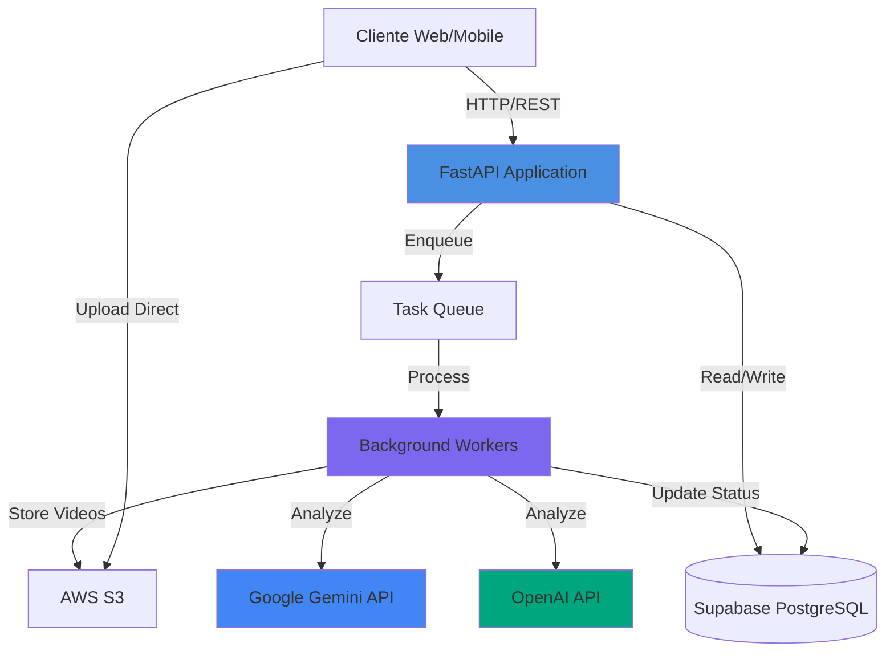
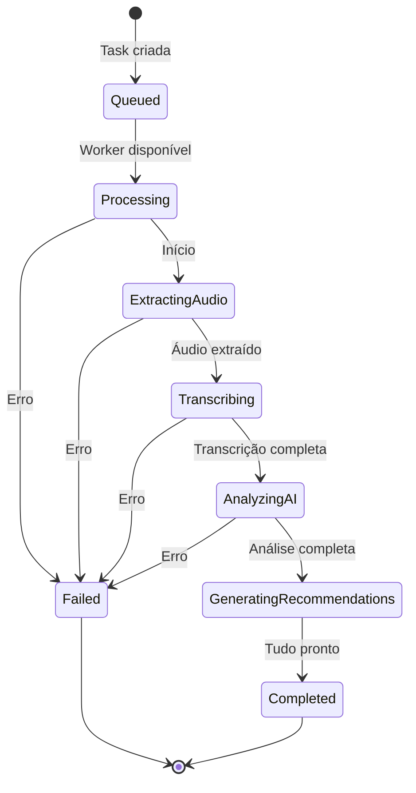
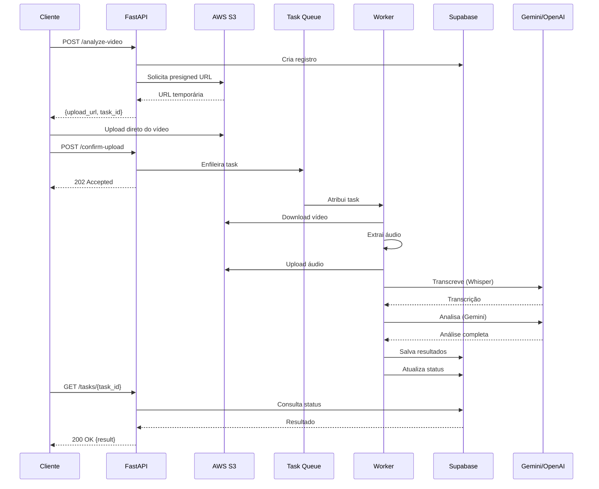
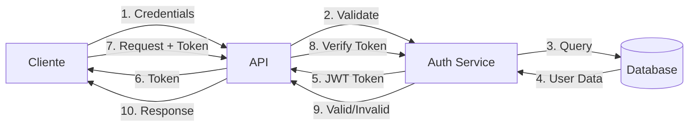

# Arquitetura do Sistema

Visão geral da arquitetura do Klike AI Services, um sistema distribuído para análise inteligente de vídeos publicitários.

##  Visão Geral

O Klike AI Services é construído com uma arquitetura moderna baseada em:

- **API REST** com FastAPI
- **Processamento assíncrono** com workers
- **Armazenamento distribuído** (S3, Supabase)
- **IA Generativa** (Google Gemini, OpenAI)
- **Microserviços** modulares e escaláveis



##  Componentes Principais

### 1. API Gateway (FastAPI)

**Responsabilidades:**

- Receber requisições HTTP dos clientes
- Validar dados de entrada
- Autenticar e autorizar requisições
- Enfileirar tasks para processamento
- Retornar status e resultados

**Tecnologias:**

- FastAPI 0.104+
- Pydantic para validação
- Uvicorn como servidor ASGI

### 2. Background Workers

**Responsabilidades:**

- Processar vídeos de forma assíncrona
- Extrair áudio e metadados
- Transcrever conteúdo
- Executar análise com IA
- Atualizar status das tasks

**Fluxo de Processamento:**



### 3. Armazenamento

#### AWS S3

- **Vídeos originais**: Raw uploads
- **Arquivos processados**: Áudio extraído, thumbnails
- **Cache**: Resultados temporários
- **CDN**: Distribuição de conteúdo

#### Supabase (PostgreSQL)

- **Metadados de vídeos**: Títulos, descrições, timestamps
- **Resultados de análise**: Scores, issues, recommendations
- **Tasks**: Estado do processamento
- **Usuários e autenticação**: Perfis, permissões

### 4. Serviços de IA

#### Google Gemini

- **Análise de criatividade**: Avaliação do conteúdo criativo
- **Detecção de issues**: Identificação de problemas
- **Geração de recomendações**: Sugestões de melhoria
- **Análise de compliance**: Verificação de políticas

#### OpenAI 

- **Geração de texto**: Recomendações detalhadas
- **Resumos**: Sínteses de análises
- **Personalização**: Adaptação por plataforma e audiência

##  Fluxo de Dados

### Upload e Análise Completa



##  Camadas da Aplicação

### Estrutura em Camadas

```
┌─────────────────────────────────────┐
│     Presentation Layer (API)        │
│  - Routers                          │
│  - Request/Response Models          │
│  - Validators                       │
└─────────────────────────────────────┘
              ↓
┌─────────────────────────────────────┐
│      Business Logic Layer           │
│  - Services                         │
│  - Managers                         │
│  - Prompt Builders                  │
└─────────────────────────────────────┘
              ↓
┌─────────────────────────────────────┐
│       Data Access Layer             │
│  - S3 Client                        │
│  - Supabase Client                  │
│  - External APIs                    │
└─────────────────────────────────────┘
              ↓
┌─────────────────────────────────────┐
│    Infrastructure Layer             │
│  - Utils                            │
│  - Audio Processing                 │
│  - Video Metadata                   │
└─────────────────────────────────────┘
```

### Detalhamento das Camadas

#### Presentation Layer

**Routers:**

- `video_router.py`: Endpoints de vídeos
- `calculator_router.py`: Calculadora de custos

**Schemas:**

- `base_schema_video.py`: Modelos de dados de vídeo
- `calculator_schema.py`: Modelos de calculadora

**Validators:**

- `video_validator.py`: Validação de vídeos

#### Business Logic Layer

**Services:**

- `video_analysis_service.py`: Orquestra análise
- `scoring_service.py`: Calcula scores
- `recommendation_service.py`: Gera recomendações
- `prompt_builder_service.py`: Constrói prompts para IA
- `background_processor_service.py`: Processamento assíncrono

**Managers:**

- `task_manager.py`: Gerencia tasks e workers

#### Data Access Layer

**S3:**

- Upload/download de vídeos
- Gerenciamento de buckets

**Supabase:**

- Presigned URLs
- CRUD de metadados e resultados
- Gerenciamento de usuários


#### Infrastructure Layer

**Utils:**

- `audio_extractor.py`: FFmpeg wrapper
- `transcribe_audio.py`: Integração Whisper
- `video_metadata_extractor.py`: Extração de metadata
- `subtitle_processor.py`: Processamento de legendas

## Segurança

### Autenticação e Autorização



### Boas Práticas Implementadas

- ✅ **HTTPS obrigatório** em produção
- ✅ **JWT tokens** com expiração
- ✅ **Rate limiting** por IP/usuário
- ✅ **Validação de entrada** com Pydantic
- ✅ **Presigned URLs** temporárias para S3
- ✅ **Secrets** em variáveis de ambiente
- ✅ **CORS** configurado adequadamente

##  Escalabilidade

### Horizontal Scaling

**Workers:**

- Múltiplas instâncias de workers
- Processamento paralelo de tasks
- Auto-scaling baseado em fila

**API:**

- Load balancer na frente
- Múltiplas réplicas
- Stateless design

### Vertical Scaling

**Recursos por Componente:**

| Componente | CPU | RAM | Armazenamento |
|------------|-----|-----|---------------|
| API | 2 vCPUs | 4 GB | 20 GB |
| Worker | 4 vCPUs | 8 GB | 50 GB |
| Database | 2 vCPUs | 4 GB | 100 GB+ |

##  Monitoramento e Observabilidade

### Métricas Importantes

- **Latência de API**: p50, p95, p99
- **Taxa de sucesso**: % de análises completadas
- **Tempo de processamento**: Tempo médio por vídeo
- **Taxa de erro**: Erros por endpoint
- **Utilização de recursos**: CPU, RAM, disco

### Logs Estruturados

```python
{
  "timestamp": "2024-01-15T10:30:00Z",
  "level": "INFO",
  "service": "video-worker",
  "task_id": "550e8400-e29b-41d4-a716-446655440000",
  "event": "analysis_completed",
  "duration_ms": 45230,
  "video_duration_s": 30,
  "score": 8.7
}
```

##  Próximos Passos

- [Fluxo de Dados](data-flow.md) - Entenda como os dados fluem
- [Serviços](services.md) - Detalhes de cada serviço
- [Integrações](integrations.md) - Integrações externas
