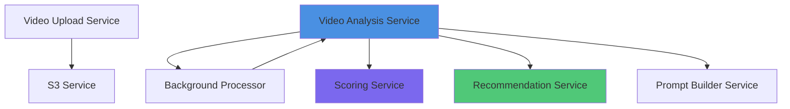

# Serviços

Documentação detalhada de cada serviço que compõe o Klike AI Services.

## 🎯 Visão Geral dos Serviços

O sistema é dividido em serviços modulares, cada um com responsabilidade específica:



## 📦 Serviços Principais

### 1. Video Upload Service

**Arquivo:** `app/services/video_upload_service.py`

**Responsabilidade:** Gerenciar uploads de vídeos para S3.

**Principais Métodos:**

```python
class VideoUploadService:
    def generate_presigned_url(
        self,
        video_id: str,
        content_type: str = "video/mp4",
        expires_in: int = 3600
    ) -> dict:
        """
        Gera URL temporária para upload direto ao S3.
        
        Args:
            video_id: UUID do vídeo
            content_type: MIME type do vídeo
            expires_in: Tempo de validade em segundos (padrão: 1h)
            
        Returns:
            {
                "upload_url": "https://s3.amazonaws.com/...",
                "fields": {...},
                "expires_at": "2024-01-15T11:30:00Z"
            }
        """
        
    def confirm_upload(
        self,
        video_id: str
    ) -> dict:
        """
        Confirma que o upload foi concluído e valida o arquivo.
        
        Returns:
            {
                "video_id": "...",
                "s3_url": "...",
                "size_mb": 45.2,
                "duration": 30.5,
                "status": "uploaded"
            }
        """
        
    def upload_video_direct(
        self,
        video_file: bytes,
        video_id: str,
        metadata: dict
    ) -> str:
        """
        Upload direto via API (alternativo).
        
        Returns:
            s3_url: URL do vídeo no S3
        """
```

**Dependências:**

- `boto3`: Cliente AWS S3
- `video_validator`: Validação de vídeos

**Uso:**

```python
from app.services.video_upload_service import VideoUploadService

service = VideoUploadService()

# Gerar URL para upload
result = service.generate_presigned_url(
    video_id="550e8400-e29b-41d4-a716-446655440000",
    content_type="video/mp4"
)

# Cliente faz upload para result["upload_url"]

# Confirmar upload
confirmation = service.confirm_upload(
    video_id="550e8400-e29b-41d4-a716-446655440000"
)
```

---

### 2. Video Analysis Service

**Arquivo:** `app/services/video_analysis_service.py`

**Responsabilidade:** Orquestrar análise completa de vídeos.

**Principais Métodos:**

```python
class VideoAnalysisService:
    def analyze_video(
        self,
        video_id: str,
        context: AnalysisContext
    ) -> AnalysisResult:
        """
        Executa análise completa do vídeo.
        
        Pipeline:
        1. Download do S3
        2. Extração de áudio
        3. Transcrição
        4. Análise com IA
        5. Cálculo de scores
        6. Geração de recomendações
        
        Args:
            video_id: UUID do vídeo
            context: {
                "audience": "jovens_adultos",
                "platform": "instagram",
                "objective": "conversao"
            }
            
        Returns:
            AnalysisResult com scores, issues, recomendações
        """
        
    def extract_and_transcribe(
        self,
        video_path: str
    ) -> Transcript:
        """
        Extrai áudio e transcreve.
        
        Returns:
            Transcript com texto, timestamps, confidence
        """
        
    def analyze_with_ai(
        self,
        transcript: str,
        metadata: dict,
        context: dict
    ) -> AIAnalysis:
        """
        Analisa conteúdo usando Google Gemini.
        
        Returns:
            AIAnalysis com insights, issues, sugestões
        """
```

**Fluxo Interno:**

```python
def analyze_video(self, video_id, context):
    # 1. Download
    video_path = self.s3_service.download(video_id)
    
    # 2. Extração + Transcrição
    transcript = self.extract_and_transcribe(video_path)
    
    # 3. Análise IA
    ai_analysis = self.analyze_with_ai(
        transcript.text,
        video_metadata,
        context
    )
    
    # 4. Scores
    scores = self.scoring_service.calculate_scores(
        ai_analysis,
        transcript,
        video_metadata
    )
    
    # 5. Recomendações
    recommendations = self.recommendation_service.generate(
        scores,
        ai_analysis.issues,
        context
    )
    
    return AnalysisResult(
        scores=scores,
        issues=ai_analysis.issues,
        recommendations=recommendations
    )
```

---

### 3. Scoring Service

**Arquivo:** `app/services/scoring_service.py`

**Responsabilidade:** Calcular scores de criatividade.

**Principais Métodos:**

```python
class ScoringService:
    def calculate_scores(
        self,
        ai_analysis: AIAnalysis,
        transcript: Transcript,
        metadata: dict
    ) -> CreativeScore:
        """
        Calcula scores baseado em múltiplos critérios.
        
        Returns:
            {
                "overall_score": 8.5,
                "hook_score": 9.0,
                "message_clarity": 8.5,
                "visual_appeal": 8.0,
                "audio_quality": 7.5,
                "call_to_action": 8.5,
                "pacing": 8.0,
                "engagement_potential": 8.8
            }
        """
        
    def calculate_hook_score(
        self,
        first_3_seconds: str,
        ai_insights: dict
    ) -> float:
        """Score do gancho inicial (0-10)"""
        
    def calculate_message_clarity(
        self,
        transcript: str,
        key_message: str
    ) -> float:
        """Clareza da mensagem (0-10)"""
        
    def calculate_overall(
        self,
        component_scores: dict
    ) -> float:
        """
        Score geral ponderado.
        
        Pesos:
        - Hook: 25%
        - Message: 20%
        - Visual: 15%
        - Audio: 10%
        - CTA: 15%
        - Pacing: 10%
        - Engagement: 5%
        """
```

**Algoritmo de Cálculo:**

```python
def calculate_overall(self, scores):
    weights = {
        "hook_score": 0.25,
        "message_clarity": 0.20,
        "visual_appeal": 0.15,
        "audio_quality": 0.10,
        "call_to_action": 0.15,
        "pacing": 0.10,
        "engagement_potential": 0.05
    }
    
    overall = sum(
        scores[key] * weight
        for key, weight in weights.items()
    )
    
    return round(overall, 1)
```

**Sistema de Descontos por Issues:**

```python
def descont_score(
    response: dict,
    score: int,
    subtitles_text_and_safezone: dict,
    non_native_vertical_aspect_ratio_violation: bool,
    aspect_ratio_frame_url: str,
    hook_cta_violations: dict,
    language: str = "en"
) -> dict:
    """
    Aplica descontos no score baseado em issues técnicas detectadas.
    
    Args:
        response: Resultado da análise com detected_issues
        score: Score inicial calculado
        subtitles_text_and_safezone: Informações de legendas e safe zone
        non_native_vertical_aspect_ratio_violation: Violação de aspect ratio
        aspect_ratio_frame_url: URL do frame de exemplo
        hook_cta_violations: Violações de limite de caracteres
        language: Idioma para mensagens
        
    Returns:
        {
            "final_score": 7.5,
            "total_discount": 2.5,
            "detected_issues": {...}  # Apenas issues True
        }
    """
    
    discount_table = {
        'small_subtitles': 4,
        'fake_content': 10,
        'subtitle_position': 8,
        'guideline_compliance': 12,
        'safezone': 10,
        'hook_cta_char_limit': 5,
        'non_native_vertical_aspect_ratio_violation': 3
    }
    
    total_discount = 0
    detected_issues_true = {}
    
    for issue, discount in discount_table.items():
        if response['detected_issues'].get(issue):
            total_discount += discount
            detected_issues_true[issue] = True
            detected_issues_true[f'details_{issue}'] = response['detected_issues'].get(f'details_{issue}')
    
    final_score = max(0, score - total_discount)
    
    return {
        'final_score': final_score,
        'total_discount': total_discount,
        'detected_issues': detected_issues_true
    }
```

**Validação de Hook/CTA:**

O sistema valida limites de caracteres por plataforma:

| Plataforma | Limite Hook | Limite CTA |
|------------|-------------|------------|
| TikTok | 60 | 30 |
| Meta | 80 | 40 |
| LinkedIn | 100 | 50 |
| YouTube | Ilimitado | 50 |

```python
def check_hook_cta_char_violations(hook: str, cta: str, platforms: list) -> dict:
    """Verifica violações de limite de caracteres."""
    limits = {
        'tiktok': {'hook': 60, 'cta': 30},
        'meta': {'hook': 80, 'cta': 40},
        'linkedin': {'hook': 100, 'cta': 50},
        'youtube': {'hook': None, 'cta': 50}
    }
    
    violations = {
        'hook_violation': {'has_violation': False},
        'cta_violation': {'has_violation': False}
    }
    
    for platform in platforms:
        limit = limits.get(platform.lower())
        if limit and limit['hook'] and len(hook) > limit['hook']:
            violations['hook_violation'] = {
                'has_violation': True,
                'detected_length': len(hook),
                'platforms': [platform],
                'limit': limit['hook']
            }
        if limit and len(cta) > limit['cta']:
            violations['cta_violation'] = {
                'has_violation': True,
                'detected_length': len(cta),
                'platforms': [platform],
                'limit': limit['cta']
            }
    
    return violations
```

---

### 4. Recommendation Service

**Arquivo:** `app/services/recommendation_service.py`

**Responsabilidade:** Gerar recomendações personalizadas.

**Principais Métodos:**

```python
class RecommendationService:
    def generate_recommendations(
        self,
        scores: CreativeScore,
        issues: List[DetectedIssue],
        context: AnalysisContext
    ) -> List[Recommendation]:
        """
        Gera recomendações baseadas em:
        1. Scores baixos
        2. Issues detectados
        3. Melhores práticas da plataforma
        4. Contexto da audiência
        
        Returns:
            Lista de recomendações priorizadas
        """
        
    def generate_from_scores(
        self,
        scores: dict
    ) -> List[Recommendation]:
        """Recomendações baseadas em scores baixos"""
        
    def generate_from_issues(
        self,
        issues: List[DetectedIssue]
    ) -> List[Recommendation]:
        """Recomendações para corrigir issues"""
        
    def apply_platform_best_practices(
        self,
        platform: str,
        recommendations: List[Recommendation]
    ) -> List[Recommendation]:
        """Adiciona melhores práticas da plataforma"""
```

**Priorização:**

```python
def prioritize_recommendations(recommendations):
    """
    Prioriza por:
    1. Severity (high > medium > low)
    2. Impact (alto potencial de melhoria)
    3. Effort (baixo esforço primeiro)
    """
    
    priority_scores = []
    for rec in recommendations:
        score = (
            severity_weight[rec.severity] * 0.5 +
            impact_score[rec.impact] * 0.3 +
            (1 - effort_score[rec.effort]) * 0.2
        )
        priority_scores.append((score, rec))
    
    return [rec for _, rec in sorted(
        priority_scores,
        key=lambda x: x[0],
        reverse=True
    )]
```

---

### 5. Prompt Builder Service

**Arquivo:** `app/services/prompt_builder_service.py`

**Responsabilidade:** Construir prompts para IA generativa.

**Principais Métodos:**

```python
class PromptBuilderService:
    def build_analysis_prompt(
        self,
        transcript: str,
        metadata: dict,
        context: dict
    ) -> str:
        """
        Constrói prompt completo para análise.
        
        Estrutura:
        1. Contexto do sistema
        2. Informações do vídeo
        3. Contexto da análise
        4. Instruções específicas
        5. Formato de resposta esperado
        """
        
    def load_template(
        self,
        language: str,
        template_type: str
    ) -> str:
        """
        Carrega template de prompt.
        
        Args:
            language: "pt" ou "en"
            template_type: "analysis", "compliance", "detected_issue"
        """
```

**Exemplo de Prompt Gerado:**

```python
prompt = f"""
Você é um especialista em análise de vídeos publicitários.

INFORMAÇÕES DO VÍDEO:
- Duração: {metadata['duration']}s
- Plataforma: {context['platform']}
- Audiência: {context['audience']}
- Objetivo: {context['objective']}

TRANSCRIÇÃO:
{transcript}

ANÁLISE REQUERIDA:
1. Avalie o gancho inicial (primeiros 3 segundos)
2. Analise a clareza da mensagem
3. Identifique pontos fortes
4. Detecte issues e problemas
5. Sugira melhorias específicas

FORMATO DE RESPOSTA:
{{
  "hook_analysis": "...",
  "message_clarity": "...",
  "strengths": [...],
  "issues": [...],
  "suggestions": [...]
}}
"""
```

---

### 6. S3 Video Service

**Arquivo:** `app/services/s3_video_service.py`

**Responsabilidade:** Gerenciar operações com AWS S3.

**Principais Métodos:**

```python
class S3VideoService:
    def upload_file(
        self,
        file_path: str,
        s3_key: str,
        metadata: dict = None
    ) -> str:
        """Upload de arquivo para S3"""
        
    def download_file(
        self,
        s3_key: str,
        local_path: str
    ) -> str:
        """Download de arquivo do S3"""
        
    def generate_presigned_url(
        self,
        s3_key: str,
        expires_in: int = 3600
    ) -> str:
        """Gera URL temporária para acesso"""
        
    def delete_file(
        self,
        s3_key: str
    ) -> bool:
        """Remove arquivo do S3"""
        
    def get_file_metadata(
        self,
        s3_key: str
    ) -> dict:
        """Retorna metadata do arquivo"""
```

---

### 7. Background Processor Service

**Arquivo:** `app/services/background_processor_service.py`

**Responsabilidade:** Processar tasks em background.

**Principais Métodos:**

```python
class BackgroundProcessorService:
    def enqueue_task(
        self,
        task_type: str,
        video_id: str,
        params: dict
    ) -> str:
        """Enfileira task para processamento"""
        
    def process_video_analysis(
        self,
        task_id: str,
        video_id: str,
        context: dict
    ) -> dict:
        """Processa análise de vídeo em background"""
        
    def update_task_status(
        self,
        task_id: str,
        status: str,
        progress: int = None,
        result: dict = None
    ) -> None:
        """Atualiza status da task"""
```

## 🔧 Managers

### Task Manager

**Arquivo:** `app/managers/task_manager.py`

**Responsabilidade:** Gerenciar workers e distribuição de tasks.

```python
class TaskManager:
    def start_workers(self, num_workers: int = 4):
        """Inicia workers para processamento"""
        
    def assign_task(self, task_id: str) -> Worker:
        """Atribui task a worker disponível"""
        
    def monitor_health(self):
        """Monitora saúde dos workers"""
```

## 📚 Próximos Passos

- [Integrações](integrations.md) - Integrações externas
- [Estrutura do Projeto](../development/project-structure.md)
