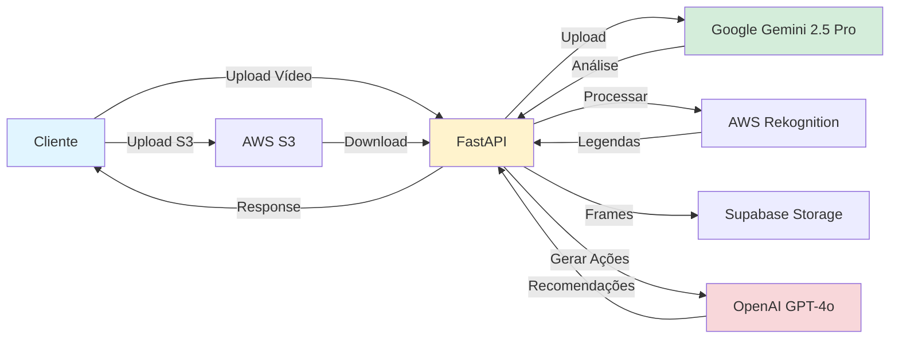

# Klike AI Services

<div align="center">
  <h2> API de Análise Vídeos</h2>
  <p>Otimize seus criativos publicitários com análise de IA</p>
</div>

---

## O que é o Klike AI Services?

O **Klike AI Services** é uma API REST poderosa que utiliza inteligência artificial para analisar vídeos publicitários e fornecer insights acionáveis para otimização de performance em plataformas como Meta, TikTok e LinkedIn.

###  Principais Funcionalidades

=== "yAnálise Criativa"
    Avalie 9 métricas criativas essenciais:
    
    - **3 Second Hook Score** - Primeiros 3 segundos que capturam atenção
    - **Storytelling with Contrast** - Narrativa antes/depois
    - **Emotional Connection** - Conexão emocional com a audiência
    - **Music, Voice-over & Subtitles** - Qualidade audiovisual
    - **Product Focus** - Destaque do produto/serviço
    - **Value Proposition** - Clareza da proposta de valor
    - **CTA Score** - Efetividade da chamada para ação
    - **Community Score** - Autenticidade e conexão
    - **Video Quality** - Qualidade técnica

=== "Recomendações Personalizadas"
    Receba ações específicas para:
    
    - **Melhorar métricas criativas** com baixo desempenho
    - **Corrigir issues técnicas** (legendas, safe zone, aspect ratio)
    - **Otimizar por plataforma** (Meta, TikTok, LinkedIn)
    - **Segmentar audiências** (Gen Z, Millennials, Gen X, Boomers)

=== "Detecção de Issues"
    Identifique automaticamente:
    
    - Legendas fora da safe zone
    - Textos pequenos ou ilegíveis
    - Aspect ratio inadequado para plataforma
    - Violações de guideline de plataformas
    - Conteúdo que parece fake/não autêntico
    - Limites de caracteres em Hook/CTA

=== "Processamento Inteligente"
    - **Background Tasks** - Análise assíncrona sem bloqueio
    - **Integração S3** - Upload direto do front-end
    - **Paralelização** - Processamento em paralelo (upload, legendas, frames)
    - **Status Tracking** - Acompanhe o progresso em tempo real

---

## Arquitetura



---

##  Quick Start

### 1. Instalação

```bash
# Clone o repositório
git clone https://github.com/klike-ai/klike-ai-services.git
cd klike-ai-services

# Crie ambiente virtual
python -m venv env
source env/bin/activate  # Windows: env\Scripts\activate

# Instale dependências
pip install -r requirements.txt
```

### 2. Configuração

Crie um arquivo `.env` na raiz do projeto:

```bash
# Google Gemini
GOOGLE_API_KEY=sua_chave_google_gemini

# OpenAI
OPENAI_API_KEY=sua_chave_openai

# AWS
AWS_ACCESS_KEY_ID=sua_access_key
AWS_SECRET_ACCESS_KEY=sua_secret_key
AWS_REGION=us-east-1
S3_BUCKET_NAME=seu-bucket

# Supabase
SUPABASE_URL=sua_url_supabase
SUPABASE_KEY=sua_chave_supabase
SUPABASE_BUCKET=seu_bucket_supabase
```

### 3. Execute a API

```bash
uvicorn app.app:app --reload --host 0.0.0.0 --port 8000
```

Acesse: [http://localhost:8000/docs](http://localhost:8000/docs)


##  Casos de Uso

!!! success "Agências de Publicidade"
    Analise dezenas de criativos antes de veiculação e otimize baseado em dados

!!! success "Equipes de Marketing"
    Entenda por que alguns vídeos performam melhor e replique o sucesso

!!! success "Criadores de Conteúdo"
    Receba feedback instantâneo sobre seus vídeos antes de publicar

!!! success "E-commerce"
    Otimize vídeos de produto para diferentes plataformas e audiências

---

